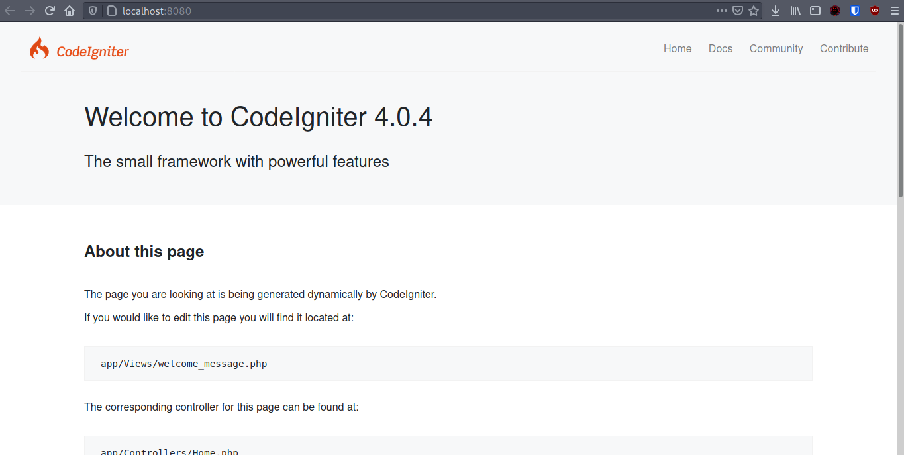
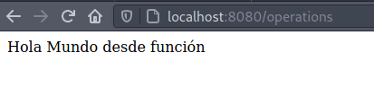

# CodeIgniter - Operaciones CRUD

Este es un laboratorio con pasos a seguir en la implementación de un sistema CRUD (Create Read Update Delete) usando CodeIgniter y MySQL.

### Requisitos

* PHP - versión 7.4
* Composer
* MySQL o MariaDB

## Creando nuestro proyecto
Corremos el siguiente comando en nuestra consola Windows o Linux, después esperamos a que se genere nuestra carpeta con los archivos necesarios.

```
$ composer create-project codeigniter4/appstarter [nombre-proyecto]
```

Luego nos metemos a la carpeta `[nombre-proyecto]`, y corremos el mini server de PHP con el comando `php spark serve` o si tienes `XAMPP` entonces genera el proyecto dentro de la carpeta `public`. Nos debería salir la página inicial así

<p align="center">
  
</p>

## Editando la ruta Home

Ahora, debemos crear un Controller. Es básicamente una clase que permite delegar el trabajo y mostrar sitios web en la url. Imaginemos que tenemos la siguiente ruta de nuestro dominio: 

`http://127.0.0.1:8080/mensaje/holamundo`

Podemos imaginarnos que hay un controller llamado "mensaje". El método invocado cuando pedimos mensajes sería "holamundo". Este método tiene como trabajo mostrar o desplegar un saludo en el HTML.

Lo que nosotros haremos es crear un archivo `Operations.php` en la ruta `app/Controllers/`. Ahora, creamos el siguiente código

```php
<?php namespace App\Controllers;

use CodeIgniter\Controller;

class Operations extends Controller
{
    public function index()
    {
        echo 'Hola Mundo desde función';
    }
}
```
Podemos ver que dirigiéndonos a la ruta `http://localhost:8080/operations` nos saldrá lo siguiente

<p align="center">
  
</p>

Y es que básicamente es la función padre de nuestro url, aquí podemos ahora redirigir a otro sitio html o tener otras funciones que nos permitirán trabajar como un API que después nos permitirá renderizar en un solo `View`.

Por el momento, podemos crear un archivo llamado `CrudSite.php` dentro de nuestra carpeta `app/Views/`. Aquí podemos definir carpetas y adentro más sitios estáticos que pueden renderizar información. Por mientras solo creamos el archivo y pegamos lo siguiente.

```html
<!DOCTYPE html>
<html lang="en">
<head>
    <meta charset="UTF-8">
    <meta name="viewport" content="width=device-width, initial-scale=1.0">
    <title>CRUD</title>
</head>
<body>
    <p>Operaciones CRUD</p>
</body>
</html>
```

Ahora, tenemos que redirigir la petición a ese archivo. En la función anterior agregaremos lo siguiente.

```php
<?php namespace App\Controllers;

use CodeIgniter\Controller;

class Operations extends Controller
{
    public function index()
    {
        return view('CrudSite');
    }
}
```
Esto tomará la petición, y retornará el archivo que hemos creado donde tendrá nuestro diseño `HTML`.

## Creación del Modelo

El modelo se utiliza para definir el esquema que es un arquetipo de valores de tabla. Entonces, tenemos que manifestar un nuevo archivo `Usuarios.php` en la carpeta `app/Models`. Inserte el siguiente código dentro del mismo archivo para establecer el modelo de usuario.

```php
<?php 
namespace App\Models;
use CodeIgniter\Model;

class Usuarios extends Model
{
    protected $table = 'usuarios';
    protected $primaryKey = 'id';    
    protected $allowedFields = ['nombre', 'email'];
}
```

## Configuración de la base de datos

Tomando en cuenta que existe una instalación de MySQL o MariaDB (la que usé yo), haremos la creación de una base de datos llamada `crud` con un usuario llamado `operaciones`.

```bash
$ sudo mysql -u root -p
[sudo] password for diracspace: 

MariaDB [(none)]> create database crud;
Query OK, 1 row affected (0.001 sec)

MariaDB [(none)]> create user 'operaciones'@'localhost' identified by 'prueba';
Query OK, 0 rows affected (0.019 sec)

MariaDB [(none)]> grant all privileges on crud . * to 'operaciones'@'localhost';
Query OK, 0 rows affected (0.068 sec)

MariaDB [(none)]> flush privileges;
Query OK, 0 rows affected (0.001 sec)

MariaDB [(none)]> exit;
Bye
```
Después de esto, debemos entrar como nuestro nuevo usuario y crear la tabla `usuarios`. Además, hacemos unas inserciones.

```
$ mysql -u operaciones -p
Enter password: 

MariaDB [(none)]> use crud;
MariaDB [crud]> create table usuarios (
    -> id int auto_increment primary key,
    -> nombre varchar(255) not null,
    -> email varchar(255) not null
    -> ) engine=innodb;
Query OK, 0 rows affected (0.089 sec)

MariaDB [crud]> show tables;
+----------------+
| Tables_in_crud |
+----------------+
| usuarios       |
+----------------+
1 row in set (0.001 sec)

insert into usuarios(nombre, email) values("Jayson De León", "jayson@gmail.com");
insert into usuarios(nombre, email) values("Kevin De León", "kevin@gmail.com");
insert into usuarios(nombre, email) values("José Hernández", "jos@gmail.com");
insert into usuarios(nombre, email) values("Mario Estéban", "mario@gmail.com");
```
Ahora, dentro de nuestro archivo `Database.php` ubicado en `app/Config/`, agregaremos las modificaciones a nuestro array de valores.

```
public $default = [
		...
		'hostname' => 'localhost',
		'username' => 'operaciones',
		'password' => 'prueba',
		'database' => 'crud',
        	...
];
```

## Operaciones CRUD (Create Read Update Delete)

Primero, debemos importar nuestra clase `Usuarios`, para así poder empezar a hacer peticiones a la base de datos. Pondremos lo siguiente al inicio del código en `Operations.php`.

```php
use App\Models\Usuarios;
```

Lo que haremos ahora es crear nuestras operaciones dentro del archivo que creamos `Operations.php`. Lo primero que haremos es editar nuestra función `index()`, ya que la usaremos para poder leer todos los registros de la tabla creada en el paso anterior cada vez que entremos.

```php
class Operations extends Controller
{
    // GET all users
    public function index()
    {
        $userModel = new Usuarios();
        $data['usuarios'] = $userModel -> orderBy('id') -> findAll();
        return view('CrudSite', $data);
    }

    // new user form 
    public function register()
    {
        return view('Create');
    }

    // POST new user
    public function create()
    {
        $userModel = new Usuarios();
        $data = [
            'nombre' => $this -> request -> getVar('nombre'),
            'email' => $this -> request -> getVar('email'),
        ];
        $userModel -> insert($data);
        return redirect() -> to(base_url('/operations'));
    }

    // GET single user for editing
    public function singleUser($id = null)
    {
        $userModel = new Usuarios();
        $data['user_obj'] = $userModel -> where('id', $id) -> first();
        return view('Edit', $data);
    }

    // PUT new user data
    public function update()
    {
        $userModel = new Usuarios();
        $id = $this -> request -> getVar('id');
        $data = [
            'nombre' => $this -> request -> getVar('nombre'),
            'email' => $this -> request -> getVar('email'),
        ];
        $userModel -> update($id, $data);
        return $this -> response -> redirect(site_url('/users'));
    }

    // DELETE user
    public function delete($id = null)
    {
        $userModel = new Usuarios();
        $data['usuario'] = $userModel -> where('id', $id) -> delete($id);
        return $this -> response -> redirect(site_url('/users'));
    }
}
```

## Crear un nuevo usuario


## License
[MIT](https://choosealicense.com/licenses/mit/)
