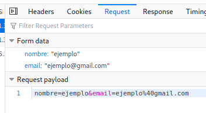

# CodeIgniter - Operaciones CRUD

Este es un laboratorio con pasos a seguir en la implementación de un sistema CRUD (Create Read Update Delete) usando CodeIgniter y MySQL.

### Requisitos

* PHP - versión 7.4
* Composer
* MySQL o MariaDB

## Creando nuestro proyecto
Corremos el siguiente comando en nuestra consola Windows o Linux, después esperamos a que se genere nuestra carpeta con los archivos necesarios.

```
$ composer create-project codeigniter4/appstarter [nombre-proyecto]
```

Luego nos metemos a la carpeta `[nombre-proyecto]`, y corremos el mini server de PHP con el comando `php spark serve` o si tienes `XAMPP` entonces genera el proyecto dentro de la carpeta `public`. Nos debería salir la página inicial así

<p align="center">
  
</p>

## Editando la ruta Home

Ahora, debemos crear un Controller. Es básicamente una clase que permite delegar el trabajo y mostrar sitios web en la url. Imaginemos que tenemos la siguiente ruta de nuestro dominio: 

`http://127.0.0.1:8080/mensaje/holamundo`

Podemos imaginarnos que hay un controller llamado "mensaje". El método invocado cuando pedimos mensajes sería "holamundo". Este método tiene como trabajo mostrar o desplegar un saludo en el HTML.

Lo que nosotros haremos es crear un archivo `Operations.php` en la ruta `app/Controllers/`. Ahora, creamos el siguiente código

```php
<?php namespace App\Controllers;

use CodeIgniter\Controller;

class Operations extends Controller
{
    public function index()
    {
        echo 'Hola Mundo desde función';
    }
}
```
Podemos ver que dirigiéndonos a la ruta `http://localhost:8080/operations` nos saldrá lo siguiente

<p align="center">
  
</p>

Y es que básicamente es la función padre de nuestro url, aquí podemos ahora redirigir a otro sitio html o tener otras funciones que nos permitirán trabajar como un API que después nos permitirá renderizar en un solo `View`.

Por el momento, podemos crear un archivo llamado `CrudSite.php` dentro de nuestra carpeta `app/Views/`. Aquí podemos definir carpetas y adentro más sitios estáticos que pueden renderizar información. Por mientras solo creamos el archivo y pegamos lo siguiente.

```html
<!DOCTYPE html>
<html lang="en">
<head>
    <meta charset="UTF-8">
    <meta name="viewport" content="width=device-width, initial-scale=1.0">
    <title>CRUD</title>
</head>
<body>
    <p>Operaciones CRUD</p>
</body>
</html>
```

Ahora, tenemos que redirigir la petición a ese archivo. En la función anterior agregaremos lo siguiente.

```php
<?php namespace App\Controllers;

use CodeIgniter\Controller;

class Operations extends Controller
{
    public function index()
    {
        return view('CrudSite');
    }
}
```
Esto tomará la petición, y retornará el archivo que hemos creado donde tendrá nuestro diseño `HTML`.

## Creación del Modelo

El modelo se utiliza para definir el esquema que es un arquetipo de valores de tabla. Entonces, tenemos que manifestar un nuevo archivo `Usuarios.php` en la carpeta `app/Models`. Inserte el siguiente código dentro del mismo archivo para establecer el modelo de usuario.

```php
<?php 
namespace App\Models;
use CodeIgniter\Model;

class Usuarios extends Model
{
    protected $table = 'usuarios';
    protected $primaryKey = 'id';    
    protected $allowedFields = ['nombre', 'email'];
}
```

## Configuración de la base de datos

Tomando en cuenta que existe una instalación de MySQL o MariaDB (la que usé yo), haremos la creación de una base de datos llamada `crud` con un usuario llamado `operaciones`.

```bash
$ sudo mysql -u root -p
[sudo] password for diracspace: 

MariaDB [(none)]> create database crud;
Query OK, 1 row affected (0.001 sec)

MariaDB [(none)]> create user 'operaciones'@'localhost' identified by 'prueba';
Query OK, 0 rows affected (0.019 sec)

MariaDB [(none)]> grant all privileges on crud . * to 'operaciones'@'localhost';
Query OK, 0 rows affected (0.068 sec)

MariaDB [(none)]> flush privileges;
Query OK, 0 rows affected (0.001 sec)

MariaDB [(none)]> exit;
Bye
```
Después de esto, debemos entrar como nuestro nuevo usuario y crear la tabla `usuarios`. Además, hacemos unas inserciones.

```
$ mysql -u operaciones -p
Enter password: 

MariaDB [(none)]> use crud;
MariaDB [crud]> create table usuarios (
    -> id int auto_increment primary key,
    -> nombre varchar(255) not null,
    -> email varchar(255) not null
    -> ) engine=innodb;
Query OK, 0 rows affected (0.089 sec)

MariaDB [crud]> show tables;
+----------------+
| Tables_in_crud |
+----------------+
| usuarios       |
+----------------+
1 row in set (0.001 sec)

insert into usuarios(nombre, email) values("Jayson De León", "jayson@gmail.com");
insert into usuarios(nombre, email) values("Kevin De León", "kevin@gmail.com");
insert into usuarios(nombre, email) values("José Hernández", "jos@gmail.com");
insert into usuarios(nombre, email) values("Mario Estéban", "mario@gmail.com");
```
Ahora, dentro de nuestro archivo `Database.php` ubicado en `app/Config/`, agregaremos las modificaciones a nuestro array de valores.

```
public $default = [
		...
		'hostname' => 'localhost',
		'username' => 'operaciones',
		'password' => 'prueba',
		'database' => 'crud',
        	...
];
```

## Configurar las rutas o url

Nos vamos a nuestro archivo `app/Config/Routes.php` y pegamos lo siguiente debajo de `Router Setup`.

```php
// CRUD operation routing

$routes -> get('delete', 'Operations::delete');
$routes -> get('edit/(:num)', 'Operations::singleUser/$1');
$routes -> post('update', 'Operations::update');
```
Con esto, podemos aminorar tener que escribir `/operations/update/ID` o url de ese tipo. Ahora, nos disminuye a `/update?id=ID`. 

## Operaciones CRUD (Create Read Update Delete)

Primero, debemos importar nuestra clase `Usuarios`, para así poder empezar a hacer peticiones a la base de datos. Pondremos lo siguiente al inicio del código en `Operations.php`.

```php
use App\Models\Usuarios;
```

Lo que haremos ahora es crear nuestras operaciones dentro del archivo que creamos `Operations.php`. Lo primero que haremos es editar nuestra función `index()`, ya que la usaremos para poder leer todos los registros de la tabla creada en el paso anterior cada vez que entremos.

```php
<?php 
namespace App\Controllers;

use CodeIgniter\Controller;
use App\Models\Usuarios;

class Operations extends Controller
{
    // GET all users
    public function index()
    {
        $userModel = new Usuarios();
        $data['usuarios'] = $userModel -> orderBy('id') -> findAll();
        return view('CrudSite', $data);
    }

    // new user form 
    public function register()
    {
        return view('Create');
    }

    // POST new user
    public function create()
    {
        $userModel = new Usuarios();
        $data = [
            'nombre' => $this -> request -> getVar('nombre'),
            'email' => $this -> request -> getVar('email'),
        ];
        $userModel -> insert($data);
        return redirect() -> to(base_url('/operations'));
    }

    // GET single user for editing
    public function singleUser($id = null)
    {
        $userModel = new Usuarios();
        $data['user_obj'] = $userModel -> where('id', $id) -> first();
        return view('Edit', $data);
    }

    // PUT new user data
    public function update()
    {
        $userModel = new Usuarios();
        $id = $this -> request -> getVar('id');
        $data = [
            'nombre' => $this -> request -> getVar('nombre'),
            'email' => $this -> request -> getVar('email'),
        ];
        $userModel -> update($id, $data);
        return redirect() -> to(base_url('/operations'));
    }

    // DELETE user
    public function delete()
    {
        $userModel = new Usuarios();
        $id = $this -> request -> getVar('id');
        $userModel -> where('id', $id) -> delete($id);
        return redirect() -> to(base_url('/operations'));
    }
}
```

## Crear un nuevo usuario

Ahora, agregaremos el siguiente en nuestro archivo `CrudSite.php` dentro de la carpeta `app/Views`.

`<a href="/operations/register">Registrar usuario</a>`

Esto hará que nuestra etiqueta nos redirija a un archivo `Crear.php` dentro de nuestra carpeta `app/Views`. Aquí generamos una form para poder insertar los datos que mandamos a la base de datos.

```html
<html lang="en">
<head>
    <meta charset="UTF-8">
    <meta name="viewport" content="width=device-width, initial-scale=1.0">
    <title>Create new user</title>
</head>
<body>
    <p>Create Form</p>
    <form method="post" action="/operations/create">
      <div class="form-group">
        <label>Name</label>
        <input type="text" name="nombre" class="form-control">
      </div>
      <div class="form-group">
        <label>Email</label>
        <input type="text" name="email" class="form-control">
      </div>

      <div class="form-group">
        <button type="submit">Add User</button>
      </div>
    </form>
</body>
</html>
```
Si nos dirijimos a `http://localhost:8080/operations/register`, nos debería salir lo siguiente:

<p align="center">
  
</p>

Lo que hará este sitio, es mandar una petición HTTP usando el método `POST` lo que significa que nuestros datos ingresados pasarán en el body del objeto `$request`.

<p align="center">
  
</p>

Luego, en nuestra función `create()` dentro de nuestra clase `Operations` nos redirije a nuestra url base. Aquí veremos a nuestros registros pero no hemos agregado la lógica para iterar los valores leídos.

## Leer todos los usuarios

¿Se acuerdan de la función `index()`? Pues esta la usaremos para volver a leer la base de datos cada que vayamos a `http://localhost:8080/operations`. 

```php
// GET all users
public function index()
{
    $userModel = new Usuarios();
    $data['usuarios'] = $userModel -> orderBy('id') -> findAll();
    return view('CrudSite', $data);
}
```
Lo que ocurre, es que generamos una nueva instancia de nuestra clase `Usuarios`. Este es nuestro modelo de datos que usamos para formar la información leída. Usamos esta instancia para consultar la base de datos por todos los registros de nuestra tabla `usuarios`, por orden de `id`. Agregamos la información a un array `$data` que pasamos a nuestro `HTML` al retornar la vista.

## Mostrar los usuarios

Ahora que leemos y tenemos un origen de información, podemos iterar el arreglo de objetos generando a su vez etiquetas para mejorar la visibilidad de dicha información.

```php
<?php foreach ($usuarios as $usuario): ?>
    <li>
        <a onclick="editUser(<?php echo $usuario['id']; ?>);">
            <?php echo $usuario['id']; ?> - <?php echo $usuario['nombre']; ?>
        </a>
    </li>
<?php endforeach; ?>
```
Aquí hacemos uso de al renderización dinámica de `CodeIgniter`. Hacemos un ciclo que genera una etiqueta `a` por cada usuario y la `id` la pasamos a una función en `JavaScript` que usaremos para luego.

Con un poco de CSS previamente

```html
<style type="text/css">
    ul {
        list-style-type: none;
    }
    .deleteusr {
        margin-top: 5%;
        margin-bottom: 5%;
    }
</style>
```

<p align="center">
  
</p>

Creamos nuestra función en `JavaScript` que nos permitirá redirijir al usuario a nuestro form para editar la información.

```html
<script type="text/javascript">
    const editUser = async (id) => {
        window.location.replace("edit/" + id);
    }
</script>
```

## Editar un usuario

Con la previa función de `JavaScript`, nos redirije a la ruta `http://localhost:8080/edit/ID` en donde el valor `ID` será el número asignado por la base de datos. Creamos un archivo `Edit.php` en la carpeta `app/Views` como los anteriores. Pondremos una form para información nueva.

```html
<html lang="en">
<head>
    <meta charset="UTF-8">
    <meta name="viewport" content="width=device-width, initial-scale=1.0">
    <title>Edit user</title>
</head>
<body>
    <p>Edit Form</p>
    <form method="post" action="/update">
        <div class="form-group">
            <label>ID</label>
            <input type="text" name="id" value="<?php echo $user_obj['id']; ?>" class="form-control">
        </div>
        <div class="form-group">
            <label>Name</label>
            <input type="text" name="nombre" value="<?php echo $user_obj['nombre']; ?>" class="form-control">
        </div>
        <div class="form-group">
            <label>Email</label>
            <input type="text" name="email" value="<?php echo $user_obj['email']; ?>" class="form-control">
        </div>
        <div class="form-group">
            <button type="submit">Update Data</button>
        </div>
    </form>
</body>
</html>
```

Debería terminar viéndose así

<p align="center">
  
</p>

## Eliminar un usuario

Ahora, para poder eliminar un usuario pues ocuparíamos la `ID`. Sin embargo, en nuestra lista de usuarios ya se muestra eso, por ende podemos agregar una form que pida el ID y haga un `POST` para poder disparar la función que elimina el registro.

```html
<form class="deleteusr" method="get" action="/delete">
    <div class="form-group">
        <label>ID</label>
        <input type="text" name="id" class="form-control">
    </div>
    <div class="form-group">
        <button type="submit" style="margin-top: 3%;">Delete user</button>
    </div>
</form>
```

Ahora, nuestra página de inicio quedaría así

<p align="center">
  
</p>

Con esto ya debería ser todo, de igual forma está el proyecto por si gustan revisarlo.

## License
[MIT](https://choosealicense.com/licenses/mit/)
